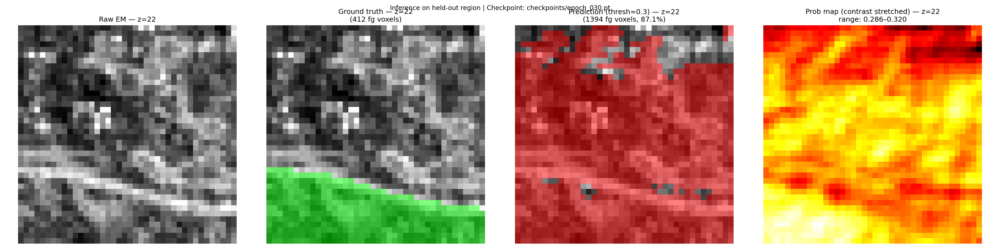

# mitotrain

A minimal end-to-end pipeline for training a 3D U-Net to segment mitochondria in
FIB-SEM electron microscopy data, using publicly available volumetric datasets from
[OpenOrganelle](https://openorganelle.janelia.org/).

This project was suggested by Jan Funke (Janelia Research Campus) as a way to learn
how the COSEM/OpenOrganelle data is organized and how it can be used to train a
segmentation model. The goal is not to reproduce state-of-the-art results, but to work
through the full pipeline — from remote data access to model training and inference —
using real scientific data and the tooling developed at Janelia.

---

## Pipeline

```
S3 (zarr/N5) → binary mask → patch sampler → 3D U-Net → BCE loss → checkpoint → inference
```

1. **Data access** — Load raw EM (`em/fibsem-uint16/s2`) and mitochondria segmentation
   (`labels/mito_seg/s2`) from the public Janelia COSEM S3 bucket using `zarr` and
   `s3fs`. No data is downloaded — all access is lazy and remote via the N5/Zarr chunked
   format.
2. **Mask generation** — Binarize instance segmentation labels (`seg > 0`) to produce a
   binary mitochondria mask (1 = mitochondria, 0 = everything else).
3. **Patch sampling** — Sample paired `(raw, label)` 132³ voxel subvolumes with
   foreground-biased rejection sampling. Foreground fraction is evaluated on the U-Net's
   40³ output region, not the full input patch.
4. **Training** — Train a 3D U-Net with `BCEWithLogitsLoss` (`pos_weight=4.0`) and
   gradient clipping (`max_norm=10.0`). 30 epochs, batch size 2, Adam `lr=1e-4`.
5. **Inference** — Load saved checkpoint, run on a held-out region never seen during
   training, visualize predicted probability map vs ground truth.

---

## Results

30-epoch CPU training run (196 minutes). Loss declined from 0.756 (epoch 1) to 0.481
(epoch 30), with a minimum of 0.461 at epoch 16.

The model produces a spatially structured probability field over the held-out region.
The probability range (0.27–0.32) is narrow, reflecting that 240 gradient steps on a
93M-parameter model without GPU is insufficient for sharp discrimination. The pipeline
is fully functional; meaningful segmentation quality requires extended training.



*Four panels: raw FIB-SEM (left), ground truth mitochondria mask (green), thresholded
prediction (red), and contrast-stretched probability map showing spatial structure learned
by the model.*

---

## Usage

**Install:**
```bash
git clone https://github.com/morrowzl19/mitotrain
cd mitotrain
python -m venv .venv
.venv\Scripts\activate        # Windows
# source .venv/bin/activate   # Linux/macOS
pip install -e .
```

> **Note:** Requires Python 3.12. The pipeline uses `zarr<3` — `N5FSStore` is not
> available in zarr v3. Do not use system Python if it is version 3.14+.

**Train:**
```bash
python train.py
```

Trains for 30 epochs, saves checkpoint to `checkpoints/epoch_030.pt` and loss log to
`outputs/loss_log.txt`.

**Inference:**
```bash
python predict.py
```

Loads `checkpoints/epoch_030.pt`, runs inference on the held-out region, saves
`outputs/inference_preview.png`.

---

## Data

All data accessed anonymously from the public Janelia COSEM S3 bucket:

```
s3://janelia-cosem-datasets/jrc_hela-2/jrc_hela-2.n5
```

| Layer | Path | Description |
|-------|------|-------------|
| Raw EM | `em/fibsem-uint16/s2` | FIB-SEM grayscale, 16 nm/vox (X/Y), 21 nm/vox (Z) |
| Labels | `labels/mito_seg/s2` | Mitochondria instance segmentation, binarized for training |

Resolution level `s2` is 4× downsampled from full resolution. Voxel sizes are
**anisotropic** — Z (21 nm) differs from X/Y (16 nm). Any coordinate math must use
per-axis scale factors.

---

## Model

3D U-Net from [funkelab/funlib.learn.torch](https://github.com/funkelab/funlib.learn.torch),
developed by Jan Funke's lab at Janelia Research Campus.

```python
UNet(
    in_channels=1,
    num_fmaps=12,
    fmap_inc_factor=5,
    downsample_factors=[(2,2,2), (2,2,2), (2,2,2)],
    kernel_size_down=[[[3,3,3],[3,3,3]]] * 4,
    kernel_size_up=[[[3,3,3],[3,3,3]]] * 3,
    num_fmaps_out=1,
    constant_upsample=True,
    activation=None,           # raw logits for BCEWithLogitsLoss
)
```

**Important:** `activation=None` must be set explicitly. The default `activation='ReLU'`
clamps outputs to `[0, ∞)` and is incompatible with `BCEWithLogitsLoss`, which expects
raw logits.

Input: `(B, 1, 132, 132, 132)` → Output: `(B, 1, 40, 40, 40)`. The spatial reduction
is due to valid (unpadded) convolutions. Labels must be center-cropped to 40³ before
computing loss.

**Parameters:** 93,633,689

---

## Project Structure

```
mitotrain/
├── train.py              # Training entry point
├── predict.py            # Inference entry point
├── pyproject.toml        # Package definition and dependencies
├── data/
│   ├── loader.py         # S3/zarr array access, normalization
│   └── sampler.py        # Foreground-biased patch sampler
├── model/
│   └── unet.py           # funkelab U-Net factory function
├── utils/
│   └── visualize.py      # Slice visualization helpers
├── checkpoints/          # Saved model weights (gitignored)
└── outputs/              # Figures and loss logs (gitignored)
```

---

## Known Limitations and Next Steps

- **GPU required for meaningful training.** 30 epochs on CPU took 196 minutes and
  produced insufficient convergence. A GPU run with 500+ epochs is the next step.
- **93M parameters may be oversized.** Reducing `num_fmaps` from 12 to 6 would cut
  parameters ~4× and speed up convergence.
- **Anomalous backward pass timing** observed at epoch 25 (940s vs typical 120–175s).
  Root cause unidentified. Must be resolved before extended training runs.
- **`zarr<3` pin** — `N5FSStore` is deprecated in zarr v3. Migration path (`n5py`) not
  yet implemented.

---

## Repository Branches

- **`main`** — clean production code only: `train.py`, `predict.py`, source modules,
  `pyproject.toml`, and `README.md`.

- **`mvp_with_artifacts`** — full development history including sprint planning docs,
  research notes, lessons learned, inspection scripts, and the trained checkpoint
  (`checkpoints/epoch_030.pt`). Also includes `outputs/loss_log.txt` and
  `outputs/inference_preview_contrast_stretched.png`.

  The planning and research documents on that branch show the full development process:
  data exploration, label source investigation, architecture debugging, and the
  incremental sprint structure used to build the pipeline.

---

## References

- Heinrich, L., Bennett, D., Ackerman, D., Park, W., Bogovic, J., Eckstein, N., ...
  & Weigel, A. (2021). Whole-cell organelle segmentation in volume electron microscopy.
  *Nature*, 599, 141–146. https://doi.org/10.1038/s41586-021-03977-3

- Funke, J. et al. *funlib.learn.torch* [Software]. Janelia Research Campus.
  https://github.com/funkelab/funlib.learn.torch

- OpenOrganelle data portal: https://openorganelle.janelia.org

---

## AI Tools

This project was developed with assistance from AI coding tools:

- Anthropic. (2025). *Claude* (Claude Sonnet 4.5, April 2026) \[Large language model\].
  Planning, research, and architecture: https://claude.ai/share/675e15d6-80cc-4b61-a8bb-400127761453

- Anthropic. (2025). *Claude Code* (Version 1, April 2026) \[AI coding assistant\].
  Implementation assistance. https://docs.anthropic.com/en/docs/claude-code/overview
